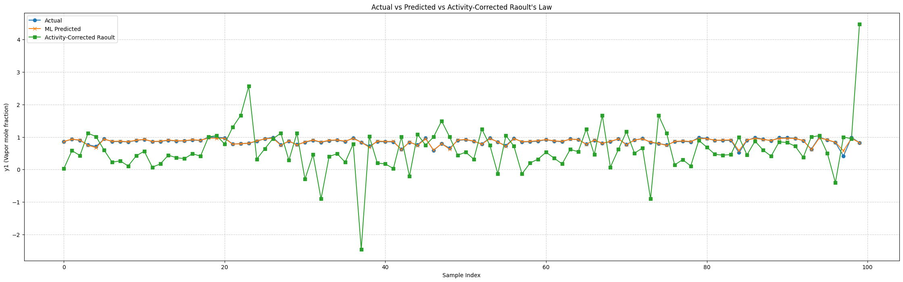

# About Dataset

The mixture **ethanol + water** is chosed as

- It is well-studied azeotropic and a ton of VLE data and models available
- Azeotropic (by weight) approx 95.6 % ethanol:4.4% water at 1 atm - which corresponds to a mole fraction ethanol approx 0.895

The Dataset produced meet the following requirements

- System: ethanol (1) + water (2) (model fractions)
- Method: Isobaric bubble-point computation using Antoine psat + one-parameter Margules acitivity model (fitted to reproduce azeotrope at 1 atm)
- Pressures: 0.1, 0.2, 0.5, 1.0, 1.2, 1.5 arm (7 isobars)
- Composition sampling: coarse at ends, very dense near azeotrope (x1 approx 0.895)
- Total points = 500

First few rows of the dataset

| x1_mol | T_K                | P_atm | y1_mol             |
| ------ | ------------------ | ----- | ------------------ |
| 0.36   | 305.4850779681948  | 0.1   | 0.6504759249717725 |
| 0.42   | 304.85666450879324 | 0.1   | 0.6789613453471901 |
| 0.44   | 304.6761976309642  | 0.1   | 0.6876128973396121 |
| 0.54   | 303.9274927248335  | 0.1   | 0.7275095529357558 |
| 0.56   | 303.80154396527917 | 0.1   | 0.7351872296757755 |
| 0.6    | 303.5678894230083  | 0.1   | 0.7506134164830885 |

# About ANN Model

```python
self.layers = nn.Sequential(
            nn.Linear(input_dim, hidden_dim),
            nn.Sigmoid(),
            nn.Linear(hidden_dim, hidden_dim),
            nn.Sigmoid(),
            nn.Linear(hidden_dim, 1)
        )
```

- Three inputs (x1_mol, T_k, P_atm) which are normalized with z-score normalization.
- Two hidden layers with each having 12 neurons.
- Sigmoid activation function.
- Loss function is Mean Square Loss (MSE).
- Optimization Algorithm is **Adam** with learning rate 0.001.
- Model is trained for 50 epochs.
- Model is saved in **onnx** format.

# Results

- Metrics for actual and predicted values
  - MSE=0.0005
  - RMSE=0.0223
  - R²=0.9507
- Metrics fot Activity-Corrected Raoult's Law Results
  - MSE=0.6011
  - RMSE=0.7753
  - R²=-58.6141
- Sample Comparison (ML vs Raoult vs Actual):  
  | ML | Raoult | Actual |
  |----------|----------|----------|
  | 0.8623 | 0.0294 | 0.8565 |
  | 0.9348 | 0.5803 | 0.9331 |
  | 0.9048 | 0.4308 | 0.8939 |
  | 0.7481 | 1.1171 | 0.7619 |
  | 0.6713 | 1.0119 | 0.7068 |
  | 0.9343 | 0.5983 | 0.9391 |
  | 0.8683 | 0.2232 | 0.8576 |
  | 0.8724 | 0.2663 | 0.8617 |
  | 0.8556 | 0.1085 | 0.8488 |
  | 0.9028 | 0.4206 | 0.8916 |

- **Comparison Graph for Actual, Predicted and Rault's law results**



# UI

For Visualization, there is an Streamlit app in the app.py file. To run the file

```python
streamlit run app.py
```
